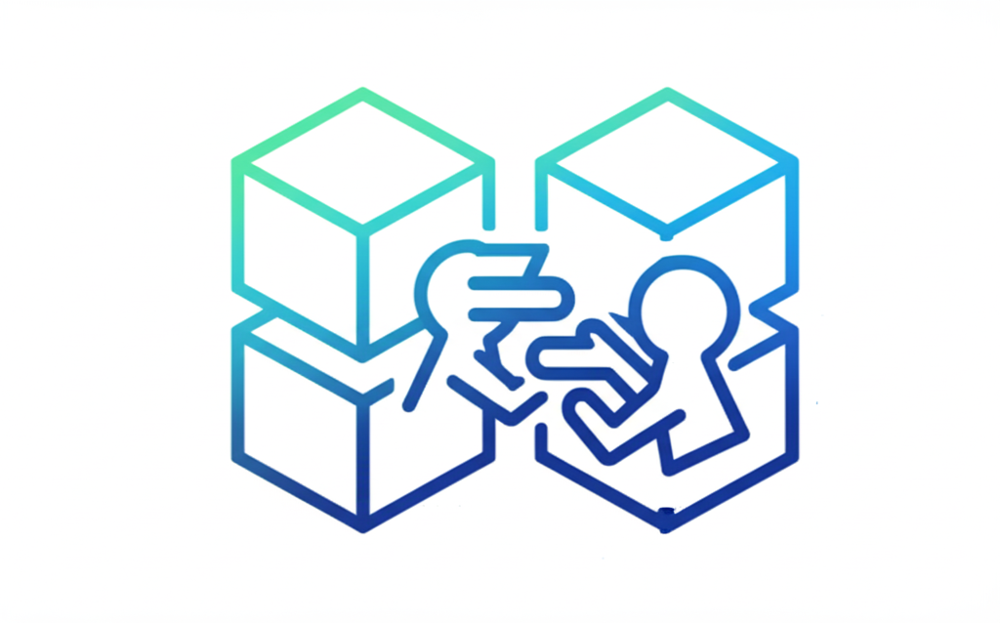

<div align="center">
  <a href="#">
    
  </a>
  
  <h1>BlockA2A</h1>
  
  <p>A Decentralized Agent-to-Agent Framework</p>
  
  <a href="LICENSE"></a>
  <a href="#"></a>
</div>

BlockA2A is a decentralized framework designed for secure, auditable, and autonomous agent-to-agent (A2A) interactions.

-   🆔 **Decentralized Identity**: Built on W3C standards, allowing agents to own and control their digital identities via the `did:blocka2a` method.
-   🤝 **Secure Collaboration**: Utilizes BLS aggregate signatures to enable multiple agents to verifiably co-authorize shared tasks and workflows.
-   🔗 **Hybrid Architecture**: Combines the security of on-chain anchors with the scalability of off-chain storage (IPFS) for a robust and efficient system.
-   🧰 **Developer-Friendly SDK**: Provides a comprehensive Python SDK to simplify interaction with smart contracts and core protocol features.

---

## 🚀 Quick Start

This guide will walk you through setting up your local development environment and running the core components of the BlockA2A protocol.

### Prerequisites

Make sure you have the following software installed on your machine.

| Software      | Recommended Version | Notes                                                              |
| :------------ |:--------------------| :----------------------------------------------------------------- |
| **uv** | `0.1.30` or later | A high-performance Python package installer. [Installation Guide](https://github.com/astral-sh/uv) |
| **IPFS Kubo** | `0.23.0` or later   | For off-chain storage. [Installation Guide](https://docs.ipfs.tech/install/command-line/) |
| **Node.js** | `18.x` or `20.x`    | Use [nvm](https://github.com/nvm-sh/nvm) to manage versions.           |
| **Python** | `3.12` or later     | Use [pyenv](https://github.com/pyenv/pyenv) to manage versions.         |
| **Git** | `2.30` or later     | For version control.                                               |

### Setup & Installation

1.  **Clone the Repository**
    Clone the project to your local machine.
    ```bash
    git clone https://github.com/Jacobzqy/BlockA2A.git
    cd blocka2a
    ```

2.  **Install Dependencies**
    This project uses `uv` and `pyproject.toml` to manage all dependencies.

    ```bash
    # Install Node.js dependencies
    npm install
    
    # Create a virtual environment and install all Python dependencies using uv.
    uv venv
    source venv/bin/activate
    uv pip install -e ".[dev]"
    ```

### Running the Local Environment

Follow these steps in separate terminal windows to launch the complete local stack.

1.  **Terminal 1: Start the IPFS Daemon**
    Initialize and start the IPFS node. This is used for off-chain storage of DID Documents and task metadata.
    ```bash
    # Initialize the IPFS repository (only needed once)
    ipfs init
    
    # Start the IPFS daemon
    ipfs daemon
    ```

2.  **Terminal 2: Start the Local Blockchain Node**
    This command launches a local Hardhat Network, which acts as your private blockchain for development and testing.
    ```bash
    npx hardhat node
    ```

3.  **Terminal 3: Deploy Smart Contracts**
    Deploy the core BlockA2A smart contracts to your local Hardhat Network.
    ```bash
    npx hardhat run scripts/deploy.js --network localhost
    ```

You now have a fully functional local Blocka2A environment running! 🎉

---

## 🏛️ Core Architecture: On-Chain Anchors & Off-Chain Storage

The BlockA2A protocol employs a hybrid storage model that leverages the unique strengths of both blockchain technology and decentralized storage networks like IPFS.

### On-Chain Layer (Blockchain)
The blockchain acts as the **ultimate source of truth and trust**. It is responsible for security, non-repudiation, and finality. However, due to cost and performance constraints, it only stores small, critical pieces of data, which we call **anchors**. These include:
-   **Identity Anchors**: The registration of a DID and the hash of its associated DID Document.
-   **Data & Task Anchors**: The hash of off-chain metadata, along with its status and expiry.
-   **Access Policies**: The rules governing access to resources.

### Off-Chain Layer (IPFS)
The InterPlanetary File System (IPFS) is used for scalable, content-addressable storage of large data payloads. This includes:
-   The full JSON content of **DID Documents**.
-   The full metadata for **collaborative tasks**.
-   Any other large data objects that require anchoring.

### The Link: Content Identifiers (CIDs)
The two layers are securely linked using **IPFS Content Identifiers (CIDs)**. The on-chain anchor record contains the immutable hash of the off-chain data *and* the IPFS CID where the full data can be retrieved. This creates a powerful, tamper-proof system:
1. The on-chain hash guarantees the **integrity** of the off-chain data.
2. The IPFS CID provides a reliable way to **retrieve** that data.

---

## 🆔 The `did:blocka2a` Method & DID Document

The identity layer is built upon the W3C DID standard. The specific method used in this protocol is `did:blocka2a`.

### Anatomy of a DID Document
A DID Document is a JSON object that contains information associated with a DID, such as cryptographic public keys and service endpoints. Here is an example:

```json
{
    "id": "did:blocka2a:1a2b3c4d5e",
    "publicKey":[
       {
          "id": "did:blocka2a:1a2b3c4d5e#keys-1",
          "type": "Ed25519VerificationKey2020",
          "publicKeyMultibase": "<base58-encoded-key>"
       },
       {
          "id": "did:blocka2a:1a2b3c4d5e#keys-2",
          "type": "Bls12381G2Key2020",
          "publicKeyMultibase": "<base58-encoded-key>"
       }
    ],
    "service": [
      {
          "id": "did:blocka2a:1a2b3#resource-1",
          "type": "AgentCommunicationEndpoint",
          "serviceEndpoint": "https://agent-a.example.com/api"
      },
      {
          "id": "did:blocka2a:1a2b3#resource-2",
          "type": "DocumentEndpoint",
          "serviceEndpoint": "https://agent-b.example.com/api"
      }
    ],
    "policy-constraints": {
       "allowed_interaction_hours": "09:00-18:00 UTC",
       "max_data_size": "10MB"
    },
    "proof": {
       "type": "Ed25519Signature2020",
       "created": "2025-06-25T20:12:00Z",
       "verificationMethod": "did:blocka2a:1a2b3c4d5e#key-1",
       "proofValue": "z4X2...<base58-encoded-signature>"
    }
}
```

-   `id`: The DID string itself, which is unique across the ecosystem.
-   `publicKey`: An array of public keys associated with the DID. Each key has a specific purpose. For example, Ed25519 keys are often used for proofs and authentication, while BLS keys are used for multi-signature schemes in collaborative workflows.
-   `service`: A list of network endpoints where the DID can be interacted with. This enables service discovery.
-   `policy-constraints`: A custom field demonstrating that DID Documents can contain verifiable claims or operational parameters for the agent.
-   `proof`: A cryptographic signature that proves the integrity and authenticity of the DID Document. It ensures that the document has not been tampered with since it was signed by the DID controller.

---
## 📄 The Smart Contract Layer

This layer contains the core on-chain business logic of the protocol, implemented as Solidity smart contracts.

### `AgentGovernanceContract (AGC)`
-   **Role**: The on-chain DID registry.
-   **Functionality**: Manages the entire lifecycle of a `did:blocka2a` identity, including registration (`register`), updates (`update`), and revocation (`revoke`). It ensures that only authorized entities can manage a DID through BLS multi-signature checks.

### `DataAnchoringContract (DAC)`
-   **Role**: A generic ledger for data anchoring and task state management.
-   **Functionality**: Allows any off-chain data to be anchored via its hash (`anchor`). Critically, it allows the status of these anchors to be updated through a BLS aggregate signature verification (`update`), making it ideal for tracking collaborative task progress.

### `AccessControlContract (ACC)`
-   **Role**: The permissioning and policy enforcement engine.
-   **Functionality**: Manages access control policies (`registerPolicy`, `removePolicy`). It evaluates these policies to determine if an agent is authorized to perform an action (`evaluate`) and issues short-lived, verifiable access tokens upon success.

### `InteractionLogicContract (ILC)` - Example
-   **Role**: An example of a custom, stateful business workflow.
-   **Functionality**: Demonstrates how the core BLS multi-signature logic can be used to build complex state machines (e.g., for a supply chain: `OrderCreated` -> `ProductionScheduled` -> `Shipped`). Transitions between states (`transition`) are triggered by multi-party consensus (i.e., a valid BLS aggregate signature).

---
## ⚙️ The SDK Layer

This layer consists of the Python SDK clients responsible for interacting with the Smart Contract Layer to create and update on-chain records.

### `TaskInitiator`: Creating Task Entries
The `TaskInitiator` client begins a collaborative workflow by creating the initial on-chain record for a task.

-   **Interaction**: It calls the `anchor` function on the `DataAnchoringContract (DAC)`.
-   **Action**: It constructs a `TaskMetadata` object, uploads it to IPFS, and submits its hash to the DAC with an "initiated" status. This creates the official, non-repudiable record of the task's existence and terms.

```python
from src.blocka2a.clients.task_initiator import TaskInitiator
import time

# Initialize the Task Initiator client
task_initiator = TaskInitiator(
    rpc_endpoint="...",
    initiator_did="did:blocka2a:...",
    data_anchoring_address="0x...",
    private_key="...",
    ipfs_gateway="..."
)

# Define the task parameters
participants_dids = ["did:blocka2a:alice...", "did:blocka2a:bob..."]
task_description = "Analyze Q1 market data and produce a summary report."
deadline = int(time.time()) + (14 * 24 * 60 * 60) # 2 weeks

# Create the initial record for a new task
cid, tx_hash = task_initiator.initiate_task(
    participants=participants_dids,
    description=task_description,
    deadline=deadline
)
print(f"Task initiated! CID: {cid}, Tx Hash: {tx_hash.hex()}")
```

### `SignatureAggregator`: Updating Task Entries
The `SignatureAggregator` is responsible for finalizing a task milestone by updating its on-chain record.

-   **Interaction**: It calls the `update` function on the `DataAnchoringContract (DAC)` or `transition` on a custom `ILC`.
-   **Action**: It collects individual BLS signatures from participants, aggregates them into a single proof, and submits this proof to the contract. The contract verifies the proof and, if valid, updates the status of the task's record.

```python
from src.blocka2a.clients.signature_aggregator import SignatureAggregator

# Initialize the Signature Aggregator client
aggregator = SignatureAggregator(
    rpc_endpoint="...",
    data_anchoring_address="0x...",
    private_key="..."
)

# Aggregate signatures from participants
# list_of_signatures = [sig_alice, sig_bob, ...]
# aggregated_signature = SignatureAggregator.aggregate(sigs=list_of_signatures)

# Submit the proof to update the on-chain record
# tx_hash = aggregator.submit_task_validation(...)
```

### `ServiceServer`: Managing Policies
The `ServiceServer` client manages the access control rules.

-   **Interaction**: It calls `registerPolicy` and `removePolicy` on the `AccessControlContract (ACC)`.
-   **Action**: It creates or deletes the on-chain policy records that define who can access its specific resource. These actions are protected by multi-signature, creating an auditable trail of policy changes.

```python
from src.blocka2a.clients.service_server import ServiceServer

# Initialize the Service Server client for a specific resource
service_server = ServiceServer(
    rpc_endpoint="...",
    acc_address="0x...",
    private_key="...",
    resource_identifier="..."
)

# Create a new policy record in the ACC
# tx_hash = service_server.register_policy(...)
```

### `BlockA2AClient`: main tool for all agent-level and identity-related operations.

#### DID Generation (`generate_did`)
A local utility function to create a `did:blocka2a` identifier from a set of public keys. This is the first step in establishing an identity.

```python
from src.blocka2a.clients import BlockA2AClient

keys = ["z6MkrpCP19trm8f...", "z6MkfGgYh4e5kQ..."]
did_string = BlockA2AClient.generate_did(public_keys_multibase=keys)
print(f"Generated DID: {did_string}")
```

#### DID Registration (`register_did`)
This function interacts with the `AgentGovernanceContract (AGC)` to publish a DID and its associated `DIDDocument`, making the identity discoverable and verifiable by others in the ecosystem.

```python
# Initialize the client
client = BlockA2AClient(...)

# Register the DID by creating a record in the AGC
# tx_hash, cid = client.register_did(...)
```

#### Task Signing (`sign_task`)
The agent uses its BLS private key to sign a task milestone. The resulting signature is then sent to a `SignatureAggregator`.

```python
# Agent's BLS private key (as an integer)
agent_bls_sk = 123456789...
task_hash = b'...' # 32-byte hash of the task metadata
milestone = "milestone-1-complete"
proof_type = "BLS256Signature2020"

# Agent signs the task milestone
individual_sig = BlockA2AClient.sign_task(
    private_key=agent_bls_sk,
    task_hash=task_hash,
    milestone=milestone,
	proof_type="BLS256Signature2020"
)
```

#### Resource Request (`request_resource`)
The agent requests access to a protected resource. If successful, the `AccessControlContract` issues a temporary `AccessToken`.

```python
# Agent requests access
# access_token = client.request_resource(...)
```

---

## ⛓️ End-to-End Workflows

### Collaborative Task Validation Flow
1.  **SDK Layer**: A `TaskInitiator` creates the initial task record by calling `anchor` on the **Contract Layer's** `DAC`.
2.  **Client Layer**: Participants, identified by their DIDs, use a `BlockA2AClient` to sign the task milestone.
3.  **SDK Layer**: A `SignatureAggregator` collects the signatures and updates the task record by calling `update` on the `DAC`. The `DAC` verifies the signatures and finalizes the milestone.

### Access Control Flow
1.  **SDK Layer**: A `ServiceServer` registers access policies by calling `registerPolicy` on the **Contract Layer's** `ACC`.
2.  **Client & SDK Layers**: An agent with a DID, using a `BlockA2AClient`, requests an access token. The client calls `evaluate` on the `ACC`, which checks the policy and issues a token.
3.  **Verification**: The `ServiceServer` verifies the presented token by calling `verifyTokenHash` on the `ACC`.

---

## 🛠️ Appendix: Core Utilities

This section is for advanced users who need to interact directly with the underlying cryptographic libraries.

### `utils.bn256` - BLS Signatures on BN254
This module provides a complete implementation of the BLS signature scheme over the BN254 (alt_bn128) curve. It is the cryptographic backbone for the collaborative task validation workflow.

-   **Key Capabilities**: Key Generation, Signing, Verification, Aggregation, and Point Compression/Decompression.

```python
from src.blocka2a.utils import bn256

# 1. Generate key pairs for two participants
alice_sk, alice_pk = bn256.generate_keypair()
bob_sk, bob_pk = bn256.generate_keypair()

# 2. Both sign the same message (e.g., a task hash)
message = b"task-hash-and-milestone"
domain = b"MyTaskDomain"

sig_alice = bn256.sign(message, alice_sk, domain)
sig_bob = bn256.sign(message, bob_sk, domain)

# 3. Aggregate the signatures
agg_sig = bn256.aggregate_sigs([sig_alice, sig_bob])

# 4. Verify the aggregated signature against the aggregated public key
is_valid = bn256.verify_fast_aggregate_same_msg(
    pks=[alice_pk, bob_pk],
    sig_agg=agg_sig,
    msg=message,
    domain=domain
)

print(f"Aggregated signature is valid: {is_valid}")
assert is_valid
```

### `utils.crypto` - Cryptographic Primitives Toolkit
This module is a versatile toolkit for handling various cryptographic key types and formats required by the BlockA2A protocol, especially for DID document construction and proof verification.

#### Key Generation (`gen_*` functions)
The module can generate key pairs for multiple cryptographic suites, which is essential for creating a comprehensive DID document.

```python
from src.blocka2a.utils import crypto

# Generate a complete set of keys for a new agent
key_set = crypto.generate_key_sets(count=1)[0]

# Ed25519 key for DID proofs
ed25519_key = key_set['ed25519']
print(f"Ed25519 Public Key (Multibase): {ed25519_key['public_key_multibase']}")

# BN256 key for on-chain task signing
bn256_key = key_set['bn256_g2']
print(f"BN256 Private Key (int): {bn256_key['private_key_int']}")
print(f"BN256 Public Key (Multibase): {bn256_key['public_key_multibase']}")
```

#### Data Conversion Utilities
The module includes helpers for interoperability between different data representations.

-   **`multibase_to_raw_public_key(multibase_string)`**: Decodes a `z...` multibase string from a DID document into raw public key bytes.
-   **`bn256_g2_pubkey_to_coords(compressed_key)`**: Converts a 64-byte compressed BN256 G2 public key into the `{x_r, x_i, y_r, y_i}` format required by Solidity smart contracts for on-chain verification.

```python
# Example: Getting coordinates for a smart contract call
pk_hex = bn256_key['public_key_hex']
coords = crypto.bn256_g2_pubkey_to_coords(pk_hex)

print(f"G2 Public Key Coordinates for Solidity: {coords}")
```

## ✍️ Citation

Please cite our paper if the codebase/documentation/examples in this repo are helpful to you!

```
@misc{zou2025blocka2asecureverifiableagenttoagent,
      title={BlockA2A: Towards Secure and Verifiable Agent-to-Agent Interoperability}, 
      author={Zhenhua Zou and Zhuotao Liu and Lepeng Zhao and Qiuyang Zhan},
      year={2025},
      eprint={2508.01332},
      archivePrefix={arXiv},
      primaryClass={cs.CR},
      url={https://arxiv.org/abs/2508.01332}, 
}
```